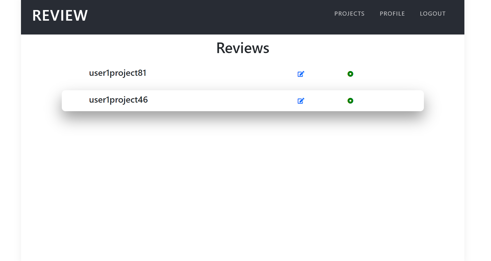
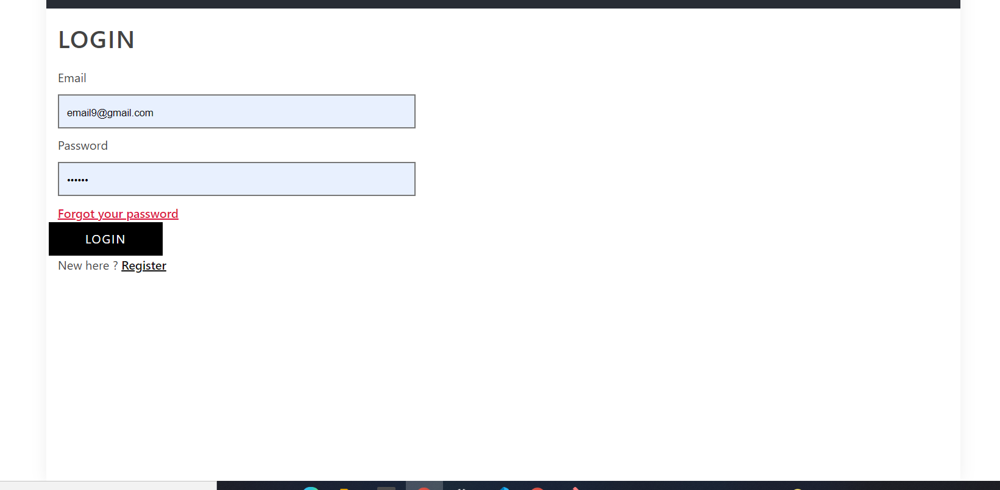
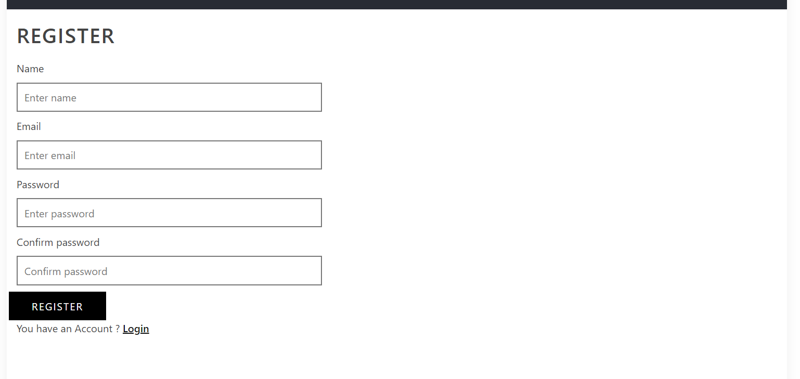
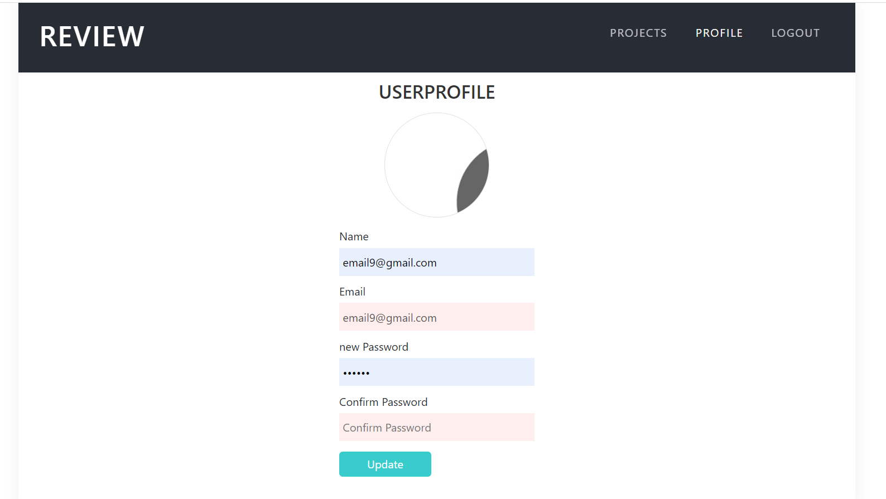
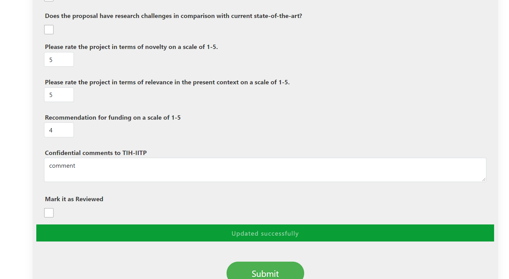
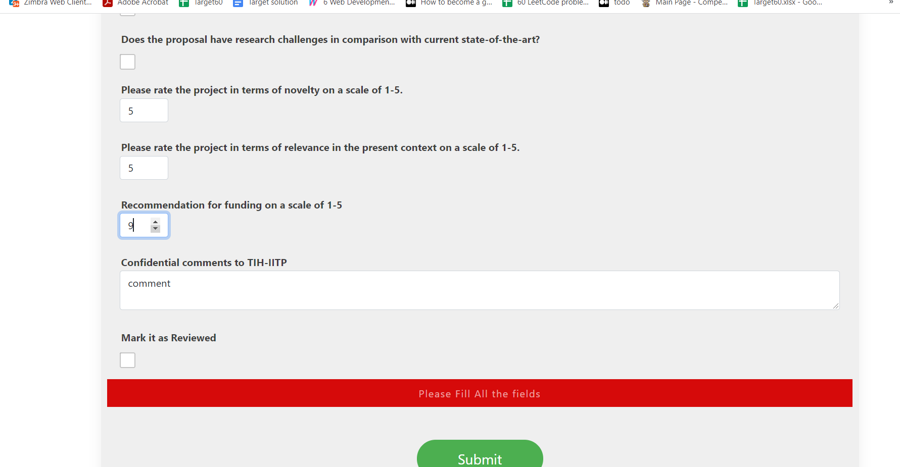

# Review_Project

A portal to manage the project submission and collecting reviews.

## Clone the repo
Install the dependencies and devDependencies and start the server.
```sh
cd Review_Project
npm i all
npm start  
cd client 

npm start
```








## Still Working
